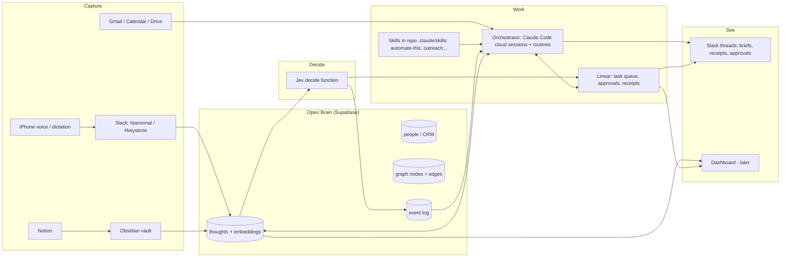

# Build Plan

Status: draft v1, 2026-10-08. Builds on `01-vision.md` (decisions) and `02-reference-systems.md` (sources).

## Principles for the build

0. **Minimal on the surface, robust underneath.** Every touchpoint should feel Apple-simple: Slack messages, briefs, approvals, any future dashboard. That means one screen, one decision, and plain words. The complexity stays behind the scenes.

1. **One phase at a time.** Each phase ends with a "done when" test. If the test fails, fix it before starting the next phase. This is the Open Stack and Four Cs rule.
2. **Lowest autonomy that works.** Every workflow starts at L1 (suggests) or L2 (drafts). It moves up a level only after it has proven itself on real work.
3. **Model-agnostic by construction.** Memory, tasks and skills sit behind open interfaces: MCP, APIs, and `SKILL.md`/`AGENTS.md` files. The orchestrator can change (Claude today, maybe Grok or another later) without a rebuild.
4. **Explain-it-back.** Every phase produces a short `docs/learn/<topic>.md` note covering what the tool does, how the data flows, and how I'd teach it to someone else. This serves the learning goal and becomes Keystone teaching material.
5. **Time-boxed.** About one phase per week, with maintenance done as voice sessions.

---

## Build map

**Read it as follows:**

- Everything I capture lands in the Brain.
- Jev sorts it.
- Anything actionable becomes a Linear task.
- The orchestrator does the work using skills and reports back in Slack.
- The event log feeds the weekly "what should we automate next" pass.

---

## Compressed schedule: target October 31

The 7-week plan is squeezed into about 3.5 weeks. The hours are mostly **my** time: accounts, approvals, interviews, testing and the "learn" notes. Agents do the building.

| Week | Dates | Phases | My hours |
|---|---|---|---|
| 1 | Oct 8–11 | **0:** accounts, operating manual, Slack test. **Quick win:** morning brief and evening reflection start immediately, because they only need Calendar and Gmail. | 4–5 |
| 2 | Oct 12–18 | **1 + 2:** `automate-this` skill and the how-I-work voice interview (45 minutes), Open Brain and Slack capture | 6–7 |
| 3 | Oct 19–25 | **3 + 4:** Jev triage, Linear tasks and receipts, permission tests | 6–7 |
| 4 | Oct 26–31 | **5:** remaining routines, the first automation-discovery pass, the BD workflow as the first real `automate-this` run | 5–6 |

**Total:** about 21–25 hours, or roughly **6–7 hours a week**, plus 10–15 minutes a day *using* it (brief and reflection).

**What compression costs:**

- Validation windows shrink from 2 weeks to 1. Triage thresholds and brief quality get less tuning before October 31.
- Phases overlap, so more things are new at once. That's a friction risk, and friction is the thing that killed past systems.
- Mitigation: the evening friction report runs from week 1. If friction spikes, pause and cut scope rather than push.

**Realistic "done" on October 31:**

- Phases 0–4 are complete.
- The morning brief and evening reflection are running daily.
- The BD workflow works in a quick-and-dirty form.
- The "two weeks of use" and the first discovered automation land in early November.

## Progress tracker

The assistant updates this table whenever I report progress, and **tells me if the projected finish moves**, earlier or later.

| Phase | Status | Planned | Projected | Notes |
|---|---|---|---|---|
| 0: Foundations | in progress | Oct 8–11 | Oct 11 | Manual drafted; accounts and Slack test pending |
| 1: automate-this + interview | not started | Oct 12–18 | Oct 18 | Process-map moved to the Keystone queue |
| 2: Memory | not started | Oct 12–18 | Oct 18 | |
| 3: Jev triage | not started | Oct 19–25 | Oct 25 | |
| 4: Tasks and receipts | not started | Oct 19–25 | Oct 25 | |
| 5: Cadence | not started | Oct 26–31 | Oct 31 | Brief and reflection start in week 1 |
| **Overall** | | **Oct 31** | **Oct 31** | |

## Phases

### Phase 0: Foundations and the Slack test (week 1)

**Build:**

- **Operating manual in this repo**, using the Herk pattern:
  - `CLAUDE.md` and `AGENTS.md` (mirrored)
  - `context/`: about me, priorities, work preferences, the daily habits list, the professionalism/personal content rule
  - `connections.md`
  - `decisions/log.md`
- **Accounts:**
  - Supabase project
  - Linear workspace
  - Slack workspace with `#personal` and `#keystone` channels
  - OpenRouter key (for embeddings)
  - TypeSafe key (already have)
- **Slack test:**
  - Connect Claude Code in Slack to this repo.
  - Send three non-coding asks from my phone, for example "summarize my calendar tomorrow" and "draft a follow-up to X."

**Done when:**

- A fresh session can explain who I am and what matters this quarter.
- The Slack test shows whether @Claude reliably runs non-coding tasks and posts back. If it doesn't, fall back to Slack, then a Linear task, then a routine picking it up.

**Learn note:** how a cloud agent session, a repo and connectors fit together.

### Phase 1: The automate-this skill and how-I-work interview (week 2)

**Build:**

- **A voice interview to capture how I work.** It follows the `grill-me` and work-operating-model patterns: rhythms, recurring decisions, dependencies, friction. The answers are saved to `context/`.
- **`.claude/skills/automate-this/SKILL.md`, which answers my top pain.** I describe what I'm doing and what a high-quality deliverable looks like. The skill then:
  1. Runs a *lightweight* map: trigger, steps, quality bar, and an autonomy level per step.
  2. Offers 2–3 automation options (maximum 3), each with its autonomy level, effort and tools.
  3. Builds the one I pick: a skill, a routine or a Linear template, filed in the right place.

**Done when:** `automate-this` has produced one real automation end to end.

**Learn note:** autonomy levels, and how a skill file works.

### Phase 2: Memory (week 3)

**Build:**

- **Open Brain core** from the OB1 guide:
  - `thoughts` table
  - pgvector
  - MCP edge function
- **Connect it to the AI tools.** Claude and ChatGPT both get the Brain as a connector.
- **Extra tables:**
  - `people`, `interactions` and `opportunities`, from the CRM extension
  - Graph nodes and edges, from `ob-graph`
  - An `events` log covering captures, triage decisions, approvals, tasks and receipts
- **Slack capture** for both channels.

**Done when:**

- The two-tool test passes: something saved in Claude is found from ChatGPT.
- A thought sent from my phone in Slack shows up in the Brain within seconds.

**Learn note:** embeddings, vector search and MCP, in plain English.

### Phase 3: Triage with Jev (week 4)

**Build:**

- **Taxonomy** in `context/taxonomy.md`: areas, projects, Keystone vs. personal, people.
- **A `decide` edge function.** It asks Jev these questions about each capture:
  - Is it actionable?
  - Which area or project?
  - Does it involve a person?
  - Does it need my decision?
  - How urgent is it?
- **Confidence thresholds:**
  - High confidence: filed automatically.
  - Medium: goes to an approval list (a Linear "Needs me" view, plus a Slack thread).
  - Low: the system asks me.
- **Logging:** every decision and its confidence goes to the `events` log. Corrections are logged as well.

**Done when:** after one week of real captures, at least 70% are auto-filed correctly. That number is a starting target to tune. Corrections are reviewed, and thresholds are adjusted once.

**Learn note:** decision models vs. LLMs, and calibrated confidence.

### Phase 4: Tasks and receipts (Open Engine on Linear, week 5)

**Build:**

- **A task template** with the seven-part record: requester, outcome, sources, acceptance criteria, boundaries, blocker rule, receipt.
- **Permission rules** written into `AGENTS.md`/`CLAUDE.md`. The agent may draft, research, organize and create tasks. I approve sending, publishing, deletion, money, credentials, and anything that affects other people.
- **A worker loop.** The orchestrator claims a task, works it, and leaves a receipt comment. When it's blocked, it asks in the task.

**Done when:**

- The smoke test passes.
- The blocked-and-resumed test passes.
- The approval test passes: the agent stops at a send boundary.

**Learn note:** handoffs, receipts, and why "done" needs evidence.

### Phase 5: Proactive cadence (weeks 6–7)

These are Claude Code routines that post to Slack, all at L1–L2 (suggest or draft only):

| Routine | When | What |
|---|---|---|
| Morning brief | Weekdays, ready by ~5 am Central | Calendar, top Linear tasks, people I'm meeting (from the Brain), habit nudges, deep-work block check |
| Meeting prep | Hourly sweep | For meetings in the next 2 hours: history, open loops, a suggested agenda |
| Follow-up sweep | Afternoon | Gmail commitments ledger: replies I owe and promises made. **Drafts only.** |
| Evening reflection | Workdays, ~5–6 pm | A voice-friendly check-in covering: - How the day went - The **friction report**, with evidence - Automation candidates - A proposed **overnight queue** for agents |
| Weekly review | Friday | A voice-friendly summary: what moved, what's stuck, habits, next week's plan |
| Automation discovery | Weekly | Reads the event log for tasks repeated three or more times, then offers 2–5 automations with evidence (`/level-up` style). I pick one to build. |

**Done when:**

- Two weeks of briefs have been used.
- One automation chosen from the discovery pass has been built and is running.

**Learn note:** scheduled agents, and loops vs. triggers.

### Phase 6: Keystone skills (ongoing, one per week after Phase 4)

These sit in the **Keystone build queue** (`context/priorities.md`). The assistant asks during planning when to build each one.

1. `process-map` (full client version): discovery, trigger/sources/transforms/decisions/destination, autonomy levels, EAD and 60/30/10, then a build-plan handoff to the developer. Needed when David Lai closes a deal.
2. `meeting-prep`
3. `bizdev-outreach` (research, then draft, then the approval queue; a quick-and-dirty version arrives in week 4)
4. `proposal-assembly`
5. `wireframe-brief`
5. `ops-runbook-writer`

**Portability:** every skill uses the open `SKILL.md` format and must be portable to the company AI stack.

### Exploration track (parallel, low effort)

- **Obsidian trial.** Two weeks of daily use for reflection and learnings. Do a one-time import of Notion exports to see how linked notes feel.
- **If Obsidian is kept:** use the OB1 `obsidian-vault-import` recipe. Run it on a schedule, deduplicated by content fingerprint, so notes become searchable in the Brain.

### Later or parked

| Item | Status | Notes |
|---|---|---|
| Dashboard (Vercel) | Build only if Slack plus Linear prove insufficient | Tabs: Intake, Today/Week, People, Approvals, Automations |
| Neo4j | Parked | Optional read-only projection of the Supabase graph, for learning Cypher |
| Live always-on session (Telegram, Discord or iMessage via Channels) | Parked | Needs a computer kept running |
| Passive time tracking | Parked | Too hard to do well on iPhone |
| Conversational scheduling with rules | Later | Comes after Phase 5, using the calendar connector plus `context/scheduling-rules.md` |

---

## Tool plan

| Layer | Tool | What it actually does | Alternatives |
|---|---|---|---|
| Operating manual | Git repo (this one) | Plain-text instructions, context and skills that any agent reads at session start | Notion pages, Obsidian |
| Memory | Supabase (Postgres + pgvector) | Stores rows. Vectors are numbers that capture meaning, so search works by idea rather than exact words. | Neon, local SQLite |
| AI ↔ memory link | MCP server (Supabase edge function) | A small web endpoint that exposes "search" and "capture" as tools any AI can call | REST API |
| Embeddings | OpenRouter | Turns text into vectors | OpenAI or Voyage directly |
| Decisions | Jev (TypeSafe) | Answers typed questions with probabilities. Fast and cheap; it never writes text. | Small LLM with structured output |
| Thinking and writing | Claude, ChatGPT (subscriptions) | Research, drafting, reasoning | Grok, Gemini |
| Orchestration | Claude Code cloud sessions + routines | Runs agent sessions on this repo, triggered from Slack or on a schedule | Grok via API, n8n, local loop |
| Tasks | Linear | Queue, owners, statuses, comments as receipts. It has an API and MCP access. | Notion DB, GitHub Issues |
| Chat front door | Slack | Capture, kicking off tasks, receiving briefs and receipts | Telegram, iMessage |
| Personal thinking | Obsidian (trial) | Local markdown notes with links and a graph view | Notion |
| Graph | Supabase graph tables | Relationships stored as rows (nodes and edges) | Neo4j |

---

## Cost model (monthly, estimates)

| Item | Early (phases 0–5) | If scaled up | Notes |
|---|---|---|---|
| Supabase | $0 | $25 (Pro) | Free projects pause after about a week idle; daily use prevents that. Upgrade for backups and headroom. |
| OpenRouter (embeddings + capture metadata) | ~$0.10–1 | ~$2–5 | The OB1 docs estimate $0.10–0.30 for 20 captures a day |
| Jev | <$1 | ~$1–3 | About $0.17 per 10k triage calls |
| Linear | $0 | ~$10 | Free tier allows 250 active issues; archive finished ones |
| Slack | $0 | ~$7–9 | Free tier has 90-day history, but the Brain keeps everything |
| Obsidian | $0 | ~$4–5 | Only if using Obsidian's paid sync instead of iCloud |
| Vercel (dashboard) | $0 | $0 | Hobby tier is enough for a personal dashboard |
| Claude subscription | existing | possibly a higher tier | Routines and Slack-triggered sessions use plan usage; heavy cadence may need a higher plan |
| ChatGPT subscription | existing | existing | |
| **Incremental total** | **~$0–5** | **~$45–60** | Excludes subscriptions already paid |

---

## Swapping the orchestrator (e.g., Grok later)

Because memory, tasks and skills sit behind open interfaces, another model can take the main-agent role. As of now, Grok can plug in four ways:

| Option | How it connects | What it can do | What you'd give up or replace |
|---|---|---|---|
| **Grok app as a front door** (web, iOS, Android; paid plan) | Add the Open Brain MCP URL, and Linear's MCP, as **custom connectors** | Chat and voice with full memory; create and update Linear tasks | Grok's own scheduling and Slack features (if any) replace Claude routines and Claude Code in Slack |
| **Grok as a worker** | Picks up Linear tasks like any other agent (Open Engine pattern) | Runs alongside Claude; each model does what it's best at | Little; this is the low-risk first step |
| **Grok via the xAI API** | The API supports **remote MCP tools**; a small script or edge function becomes a custom orchestrator | Full control, including a Slack bot backed by Grok | You build and host the loop yourself |
| **Grok voice agent** | xAI's Voice Agent API can call the same MCP tools | A hands-free orchestrator while driving | Build work, as above |

**The rule that keeps this possible:** never put a Claude-only feature at the center. Memory goes in Supabase over MCP, tasks in Linear, and instructions in `AGENTS.md` plus `SKILL.md`. Claude-specific pieces stay at the edges and can be replaced: Claude Code in Slack, routines and Channels.

**Caveat:** some Grok surfaces (reportedly the Grokbot desktop app) don't support custom connectors yet. Check the current state before switching.

---

## Model routing

**Default: GPT-6.1 Sol** for most work. **Escalate to Opus 5.5 at high effort** only where it measurably wins. **Jev** handles every pure decision.

| Route to | Work |
|---|---|
| **Jev** | Any yes/no, category or score question: triage, routing, "needs approval?", acceptance checks |
| **Sol (medium/high)** | Summaries, briefs, research, routine drafts and emails, first-pass process maps, data cleanup, well-scoped code fixes |
| **Opus 5.5 (high)** | UI/UX and visual design (dashboard, wireframes); long autonomous multi-file builds of the OS; client-facing Keystone deliverables where polish matters; ambiguous, high-stakes reasoning (agreements, strategy) |
| **Escalation rule** | If Sol fails an acceptance check twice, rerun on Opus. Track cost per *accepted* task, not per token. |

**Avoid "max" effort on Opus.** Testers report it can run out of output tokens while still reasoning. "High" is the practical ceiling.

**Plumbing:**

- Claude Code sessions and routines run Claude models. Sol runs through Codex (ChatGPT subscription) or the OpenAI API.
- The Linear queue is how work gets to the right model: tasks labeled `model:sol` are picked up by a Codex worker, and `model:opus` by Claude Code.
- This matches the Ringer pattern from Nate's library: an orchestrator plus cheaper workers.
